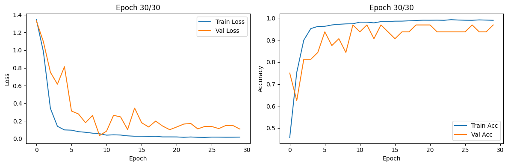

# 基于ResNet、ViT微调实现胸部X-Ray图像肺炎分类

>本项目数据集来自于[**Chest X-Ray (Pneumonia,Covid-19,Tuberculosis)**](https://www.kaggle.com/datasets/jtiptj/chest-xray-pneumoniacovid19tuberculosis)，其是一个医学图像数据集，包含 COVID-19、 Normal、 Pneumonia、 Tuberculosis 四种类型。

## 一、项目结构
请安装 python 的项目管理工具[**uv**](https://docs.astral.sh/uv/)，并使用`uv sync`命令同步项目依赖。

项目的文件夹结构如下：
~~~   
chest_x-ray_classification
+ .venv  # uv（python的项目管理工具）虚拟环境
+ assets  # 存放训练结果和资源文件
+ data  # 存放数据集
- .gitignore  # git忽略文件
- .python-version  # python版本控制
- ch01_resnet152_finetune.ipynb  # ResNet152全连接层微调
- ch02_resnet50_train.ipynb  # ResNet50全参数微调
- ch03_vit_finetune.ipynb  # ViT_b_16全连接层微调
- pyproject.toml  # uv配置文件
- README.md  # 项目说明文档
- uv.lock  # uv依赖包版本控制
~~~

## 二、核心模块

>本项目实验基于 Kaggle 提供的 notebook 环境，所得训练权重存放于[**chest_x-ray_classification_weight**](https://www.kaggle.com/models/yukikonata/chest_x-ray_classification)。

### ch01_resnet152_finetune.ipynb

基于预训练模型**ResNet152的全连接层微调**，其实际训练脚本位于[chest-x-ray-resnet152-finetune](https://www.kaggle.com/code/yukikonata/chest-x-ray-resnet152-finetune)。训练过程如下：

### ch02_resnet50_train.ipynb

基于预训练模型**ResNet50的全参数微调**，其实际训练脚本位于[chest-x-ray-resnet50-train](https://www.kaggle.com/code/yukikonata/chest-x-ray-resnet50-train)。训练过程如下：

### ch03_vit_finetune.ipynb

基于预训练模型**ViT-b-16的全连接层微调**，其实际训练脚本位于[chest-x-ray-vit-b-16-finetune](https://www.kaggle.com/code/yukikonata/chest-x-ray-vit-b-16-finetune)。训练过程如下：

## 三、实验结论 
下面对三种模型训练策略的结果进行分析和总结。

1. **预训练模型与微调策略**  
   - ResNet152只微调全连接层即可达到优秀性能，说明较深的卷积网络在医学影像任务中能够提取更丰富的特征。
   - ResNet50全参数训练虽然在某些类别上表现极佳，但整体存在类别不平衡问题，尤其是NORMAL类召回明显不足，需要进一步调整数据平衡策略或正则化措施。
   - ViT模型在仅微调全连接层时，整体效果略逊一筹，可能需要尝试部分解冻或者更多数据增强来提升性能。

2. **类别不平衡问题**  
   - 三种方法均在NORMAL类上出现召回较低的情况，表明数据分布不均可能导致模型对样本量较多的类别产生偏倚，后续可以考虑进一步优化类别权重、数据采样策略或者设计针对性损失函数。

3. **整体结论**  
   - 若硬件条件允许，**ResNet152的全连接层微调**是一个不错的选择，因为它在保持训练成本较低的同时达到了较高的准确率和各类别平衡性。
   - 对于ResNet50全参数训练，则需要加强对类别不平衡问题的处理，例如数据增强、类别重采样或者损失函数调优。
   - 对ViT模型，可能需要进一步的微调策略（例如部分层解冻、较高学习率或更大数据量）来发挥其优势。
